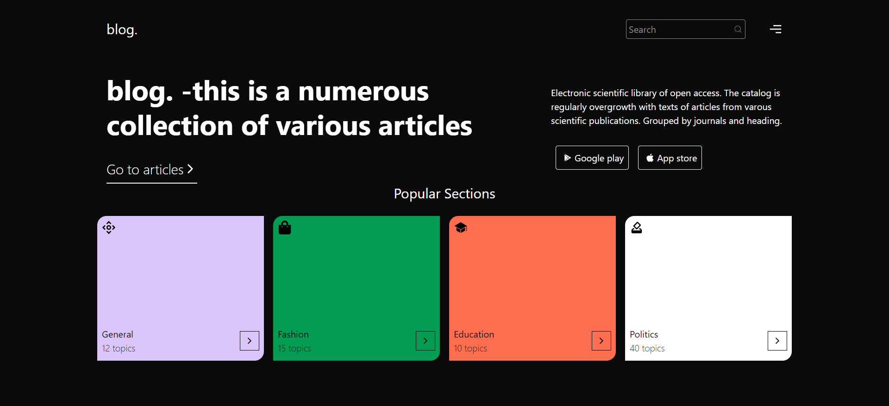
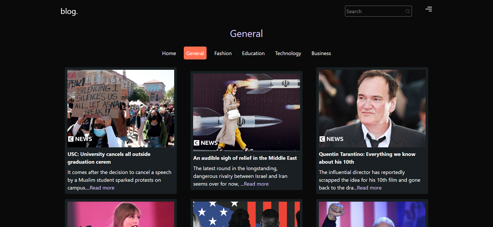

# blog. 🚀

## Core idea 💡

This is a website that has numerous collection of various articles. It showcases
the latest news and articles. it shows different categories of articles.

## Key Features 📚

- ⚡ [React.js](https://react.dev/blog/2023/03/16/introducing-react-dev) with App Router support
- 🛠️[ESlint](https://eslintorg.) Integration:
- 💎 Integrate with [Tailwind CSS](https://tailwindcss.com) styling
- 📏 Linter with [Prettier](https://prettier.io/),
- 🔥 Page rendering with [ReactRouter](https://reactrouter.com/en/main),

## Tech Stack 💻

## How to use

- Clone the repository
- Run npm install
- Run npm run dev
